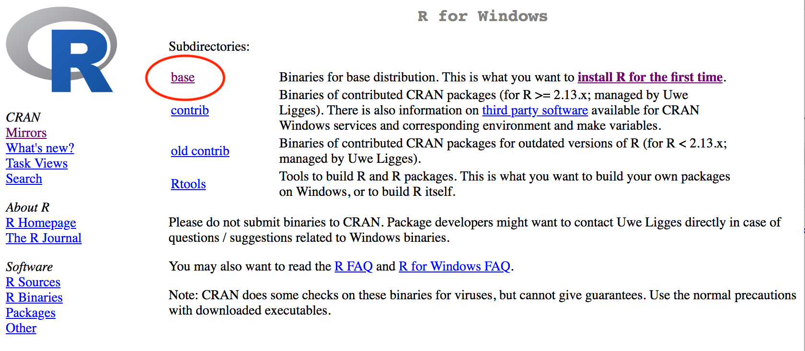
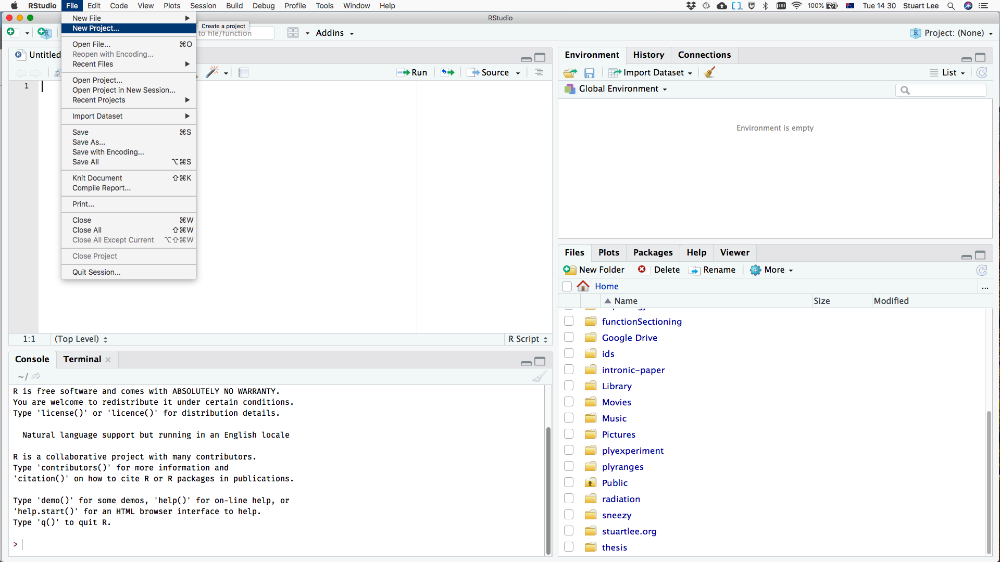
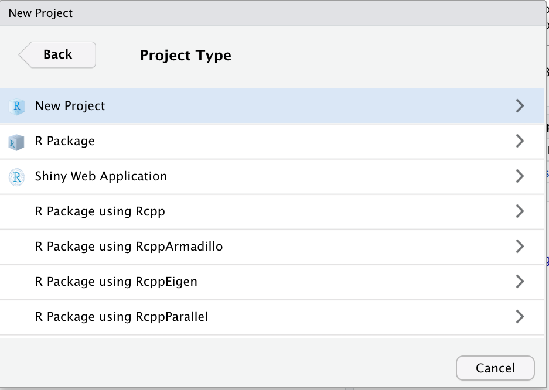
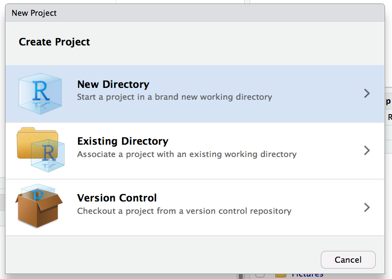
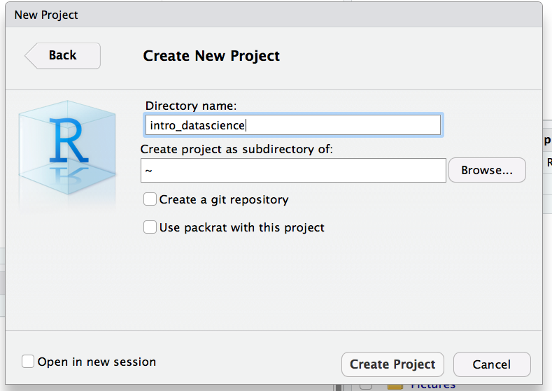
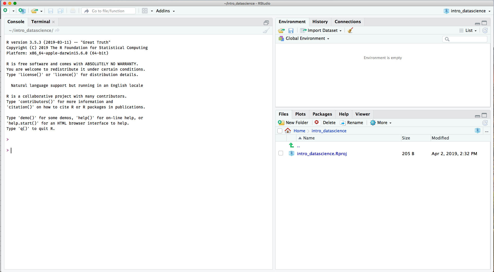

```{r setup, include=FALSE}
library(knitr)
opts_chunk$set(echo = TRUE,
               warning = FALSE,
               message = FALSE,
               fig.align = "center",
               fig.height = 6,
               fig.width = 4,
               root.dir = here::here(),
               comment = "#>"
)
```


The language of data analysis is the R programming language.  It powers the
work of people like data scientists, statisticians, social and natural
scientists all over the world by allowing them to perform and communicate their
data analyses in a principled way.

Throughout this course you'll learn how to program in R and use the R
programming language to make graphics, produce reports and even create
interactive web applications. Before you do, you'll need to get yourself ready
by installing:

 * the R programming language on your computer
 * an integrated development environment (IDE) called RStudio that allows you to write R programs and interact with R code on your computer.

There are many other guides available for installing R that are just a web
search away. One particular favourite is this guide by Kieran Healy from his
[Data Visualisation book](http://socviz.co/index.html#install). It is also
worth reading the [appendix](https://socviz.co/appendix.html) which provides a
comprehensive tutorial on how to read R documentation.

## Getting started: what's the difference?

You might be asking: so what's the difference between R and RStudio? [Julie
Lowndes](http://jules32.github.io/resources/RStudio_intro/) gives a great
answer:

> If R were an airplane, RStudio would be the airport,
providing many, many supporting services that make it easier for you, the
pilot, to take off and go to awesome places. Sure, you can fly an airplane
without an airport, but having those runways and supporting infrastructure is a
game-changer.

The following provides an overview of how to download, install and get up and
running with R and RStudio.


## Download and install R

You can [download the R language from the Comprehensive R Archive
Network](https://cran.r-project.org/) or CRAN for short.

On the CRAN website, there are a list of links to download R for different
operating systems, for example, Linux, (Mac) OS X and Windows. To download R to
your computer, select the link that corresponds to your operating system. You
can then install R.

## Download and install RStudio

Once you have installed R, you are ready to install RStudio. For this course,
the free version of RStudio is suitable. Get RStudio from the [RStudio
downloads page](https://www.rstudio.com/products/rstudio/download/). Select the
__'Download'__ link and then select the installer that corresponds to your
operating system.


## R and RStudio on Windows

If you are a Windows user, the CRAN website will redirect you to a page with a
list of subdirectories. Select the link called **`base`**.

_Please note, the following image is an example only; the version listed on the
website may differ._

```{r, echo = FALSE, fig.cap="CRAN website, Windows link"}

```


You will be directed to a new page with a link to download R, for example,
**`Download R 3.6.2 for Windows`**. Select the link to download R for Windows.


Once R has finished downloading, open the __.exe__ file and work through the
setup prompts. Once the setup is complete, [download the latest version of the
RStudio](https://www.rstudio.com/products/rstudio/download//#download)
executable. Then, open the __'.exe'__ file and work through the setup prompts.

## R and RStudio on Mac OS X

If you are a Mac OS X user, the CRAN website will redirect you to a page with a
list of releases. Select the link, for example, **`R-3.6.2.pkg`** to download
the latest release.

_Please note, the following image is an example only; the version listed on the
website may differ._

```{r, echo = FALSE, fig.cap="CRAN website, MacOS  link"}
knitr::include_graphics("img/R-install-macos.png")
```

Once R has finished downloading, open the __'.pkg'__ and then work through the
setup prompts. Once the setup is complete, [download the latest version of
RStudio](https://www.rstudio.com/products/rstudio/download/#download). Then,
open the __'.dmg'__ file and then follow the prompts.

## Check your installation!

Well done, you've installed R and RStudio on your computer. Open RStudio to
check that everything has installed correctly and to explore the RStudio
interface. The RStudio interface should be divided into __four__ panes:

- __scripts__ pane - the place where you write and save your R code.

- tab for the __console__ - the place where your code gets run. You can write code directly in here, but you might forget the code you write, so it's a good idea to write your code in the __scripts__ pane.

- tab  for __Files__, __Plots__, __Packages__, __Help__, and a __Viewer__ - files are listed here, just like a 'Finder' in Mac OS X or 'My Computer' in Windows.

- tab for __Environment__, __History__ and __Connections__ -  things you create in R that are a result of code being run, such as data, objects and models are listed in the __Environment__.

```{r, echo = FALSE, fig.cap = "The Rstudio IDE"}
knitr::include_graphics("img/Rstudio-01.png")
```

## Playing with the console

Continue to explore RStudio by making your way through this exercise - using R
as a calculator. At the prompt of your __console__ in RStudio, run the
following code chunk:

```{r calculator, eval = FALSE, echo = TRUE}
1999 * 2 / 1000

(39 + 13 + 2) / 4

cos(pi)
```

Store the results of your computation as an object using the left arrow
**`<-`** (The shortcut in RStudio is __Alt + -__).

Again, at the prompt of your __console__ in RStudio, run the following code
chunk:

```{r calculator-02, echo = TRUE}
my_variable <- 7 * 8
```

### What's it doing?

This is read as **`my_variable`** gets the value of **`7*8`**. In your RStudio
the object called **`my_variable`** should be listed in the __Environment
pane__.

Print the value of **`my_variable`** again by typing **`my_variable`** at the
console.

### Naming conventions are important!

Names of objects are important. You want them to be descriptive, and if you
have multiple words in a name you need a way of dealing with that.

The convention we will use in this course is *snake_case*, where we separate
multiple words by an underscore, and use all lower case. The most important
thing though is to be consistent with your names.

Names are __case sensitive__ and their __spelling__ matters, otherwise R will
not be able to correctly interpret the result.


Try running the following code:

```{r calculator-03, eval = FALSE}
my_Variable

my_varíable
```


### Why does R give you an error?

R gives an error for the first line of code because there was an upper case
**`V`** instead of a lower case **`v`**. Similarly, the second is an error
because there was an accented **`i`** instead of an unaccented **`i`**.


## Using functions

Most computations are performed by using _functions_. Functions take some input
(arguments) and return an output. As an example, let's use R’s built-in random
number generator function **`runif()`** to generate 10 random numbers between 0
and 1.

If you type the number 10 as the first argument you will get 10 random numbers
between 0 and 1.

```{r calculator-04, echo = TRUE}
runif(10)
```

If you type **`runif()`** in the RStudio console and then press __TAB__ on your
keyboard, a floating tooltip will appear that contains the names of the inputs
to the function.

You can be more explicit by specifying each input:

```{r calculator-05, echo = TRUE}
runif(n = 10, min = 0, max = 1)
```

By changing the values of the arguments, we can finally generate our numbers
between 0 and 10.

```{r calculator-06, echo = TRUE}
runif(10, min = 0, max = 10)
```

And you can save the result to an object using the **`<-`** operator.

```{r calculator-07, echo = TRUE}
y <- runif(10, min  = 0, max = 10)

y
```

### Computing summaries

So far, you've explored the basics of using R as a calculator and creating
objects and calling functions.

Consider expanding your R vocabulary by using the following functions to
compute the **mean** using the **`mean()`** function, the **variance** using
the **`var()`** function, and the **range** using the **`range()`** function of
the object **`y`** you just created. Again, you can do this from the
__Console__.

Remember, if you are not sure how to use the function, type the name of it in
the console and press __TAB__ on your keyboard.


## Lab Exercise: so random!

  * __You may have noticed the numbers you generated at your R console are different from the ones presented earlier. Why is that?__
  * __Look up the help file for the function `set.seed` by typing a question mark in front of it at the console: `?set.seed`.__ If you need help understanding
  this read over this [document](https://socviz.co/appendix.html).
  * __How could you use it to ensure you get the same random numbers?__

## Setting up for success: data science workflow

When working on a new project, it is possible for your files to be spread out
and stored in different locations across your computer.

This can create problems, particularly when you are programming because knowing
exactly where your files are is really important. When they are spread out,
this makes extra work for yourself.

## Getting into the workflow

Storing files in folders, and folders in a 'filing cabinet' helps centralise
your work: it keeps it organised so it is easier to find.

Using __RStudio projects__ is like providing a filing cabinet for your work!
Using them centralises your work, making your life easier as you do not have to
manage where files are. For each project, you need to create __one__ RStudio
project.

## Creating a new RStudio project

Make your way through the following steps to create an RStudio project on your
computer for all the work that you'll do in this course.

### Step 1: Start a new project

On your computer, open RStudio. Then, select **'File'** &gt; **'New Project'**.

```{r, echo = FALSE, fig.cap = "Setting up projects"}

```

### Step 2: Set a directory

A pop-up window labelled **'New Project'** should be displayed in RStudio. From
the pop-up window, select **'New directory'**.

```{r, echo = FALSE, fig.cap = "Selecting a directory"}

```


### Step 3: Select the project type

You're creating a new project, so select **'New project'**.

```{r, echo = FALSE, fig.cap = "Project type"}

```


### Step 4: Give your directory a name

Enter the name of the directory you want to create. It would be a good idea to
name it by the course you are taking, like "intro_datascience".

Select **'Create project'** once you've named your directory.

```{r, echo = FALSE, fig.cap = "Naming the project"}

```

### Step 5: Well done, you've now created a RStudio project!

Your RStudio will have a projects tab on the upper right hand corner. Remember,
every time you start to work on something for this course, be sure to open this
project!


Whenever you are ready to write code for the course go to your project folder
and then select the <strong>'.Rproj'</strong> file. This will automatically
open RStudio and take you to the right directory!

```{r, echo = FALSE, fig.cap = "The final view:"}

```

## Installing packages

Packages are the way R users share useful code. You can think of each R package
as a book. Once you've installed a package, you can load the code contained in
it using `library` - which is like checking out a book from the library!

There are more than 14,000 packages available on
[CRAN](https://cran.r-project.org/) contributed by a range of R users, from
experts to those relatively new to R. There are another thousand or so on the
[Bioconductor](https://www.bioconductor.org/) archive, which focuses primarily
on bioinformatics applications.  There are many more on people's Github pages
that may be in development. For example: [Earo Wang's `mists`
package](https://github.com/earowang/mists)

As an example, you can install the `rmarkdown` package for making reproducible
reports using the following code chunk:

```{r pkg, eval = FALSE, echo = TRUE}
install.packages("rmarkdown")
```

## Lab Exercise: Setting yourself up for the course

Continue to develop your skills in RStudio by making your way through this
exercise. Follow the instructions specified in __'Creating a new RStudio
project'__ to create another RStudio project that will contain all your
materials as you work through this course.

Then, use the console to install the [`tidyverse`](https://www.tidyverse.org/)
and [`visdat`](http://visdat.njtierney.com/) packages. You'll use these
packages throughout the course to read, visualise and analyse data.

After you’ve installed the packages, run `library(tidyverse)` at the console,
then, run the following code chunk:

```{r diamonds, eval = FALSE, echo = TRUE}
glimpse(diamonds)
filter(diamonds, carat <= 2.5)
```

* __What happened when you ran `library(tidyverse)` at the console?__
* __Do you think that you'll always need to run that code to use the `tidyverse`?__
* __What happened when you ran the code chunk?__
